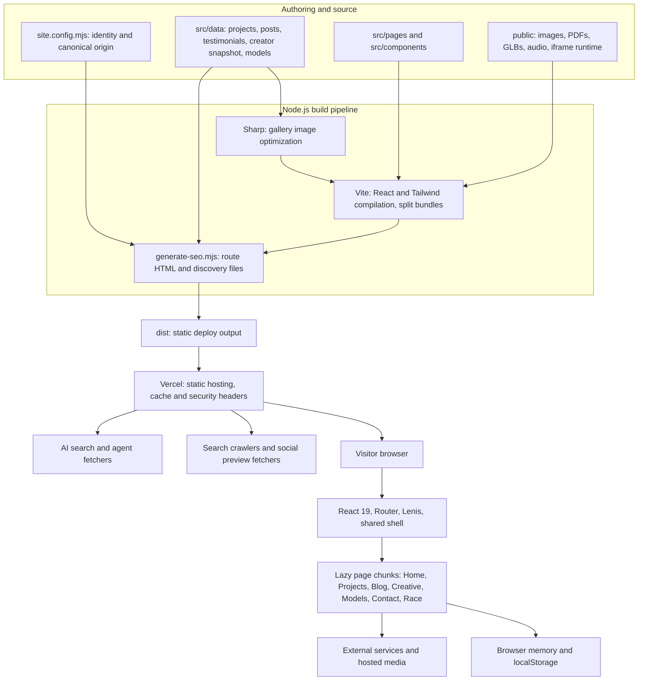
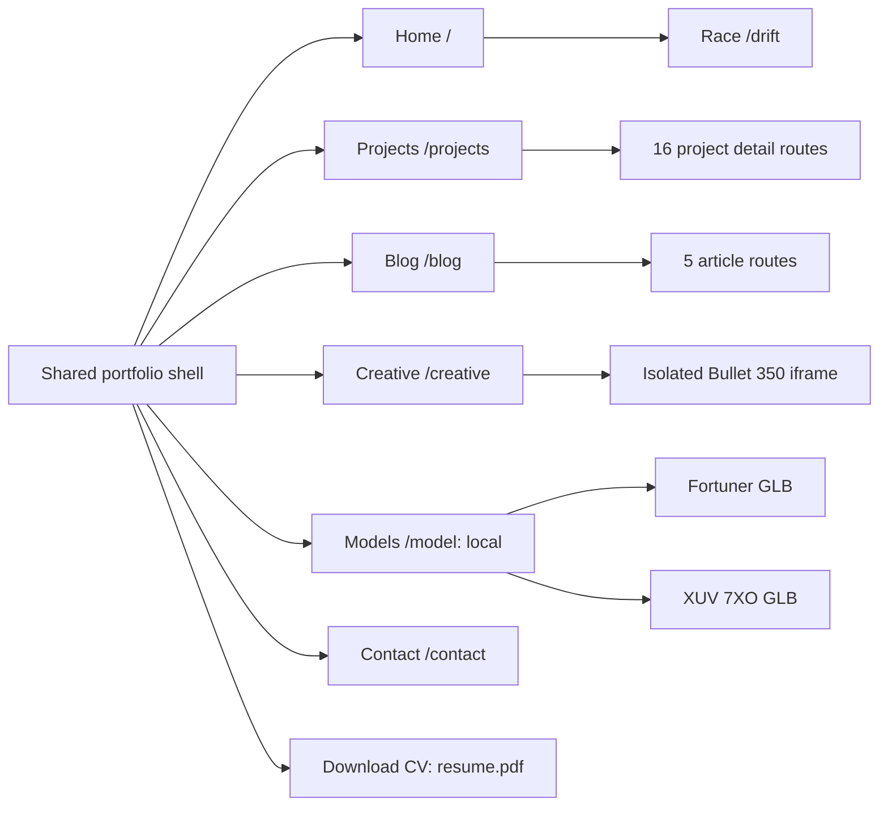
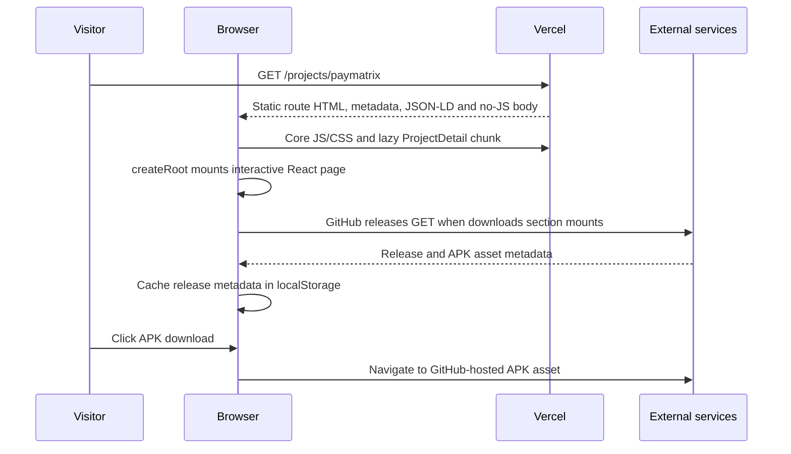
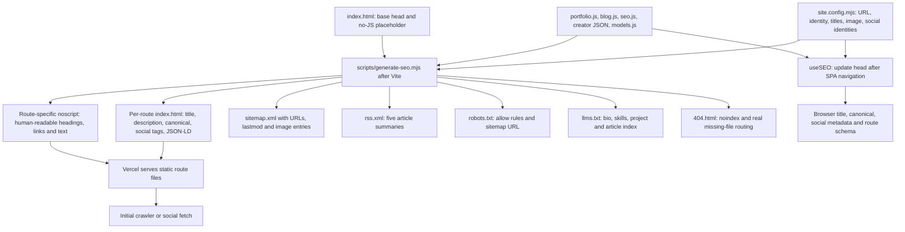

# Portfolio architecture and discovery guide

Inspection date: 4 October 2026 (Asia/Kolkata). Website: https://www.harshilpatel.co.in/.

This guide describes the inspected local working tree and separately records live HTTP checks. The working tree changed during inspection, so this is a snapshot of work in progress, not an immutable release audit. No application code was changed for this guide.

Claim labels: **verified** means observed in source or a stated HTTP check; **historical** means a dated record; **needs-confirmation** means runtime/account evidence was not inspected; **recommendation-not-fact** means a proposed improvement.

## 1. Overall system

The portfolio is a static-hosted React application with build-generated route metadata and text fallbacks. It uses client-side routing after startup. It does not server-render React on each request, and the generated HTML is not a full prerender of the React component tree: it is a shared shell with route-specific metadata, structured data, and a no-JavaScript text body. React uses `createRoot`, not `hydrateRoot`.

**Runtime technologies, verified from package.json and imports:**

| Technology | What this website uses it for |
|---|---|
| React 19 + React DOM | Page components, state, event handling and browser mounting |
| React Router DOM 7 | BrowserRouter, links, route selection, project/blog slug parameters |
| Vite 8 + React plugin | Development server, production compilation and bundling |
| Tailwind CSS 4 + custom CSS | Responsive layouts, styling, theme tokens and effects |
| Framer Motion 12 | Reveals, transitions, counters, spring scroll progress and motion preferences |
| Lenis | Smooth scrolling and route/section scrolling |
| GSAP | Animated mobile navigation; separated from core bundles |
| Three.js | WebGL scenes, model loading, race geometry, camera and lighting |
| React Three Fiber | React-managed 3D canvas for race and driving teaser |
| Mermaid | Interactive paymatrix architecture diagrams inside its case study |
| React Icons | Interface and technology icons |
| Vercel Analytics | Analytics component mounted globally; reporting requires account verification |
| Sharp | Build/maintenance image resizing, AVIF/WebP/JPEG generation |
| Oxlint | Repository lint command |
| Capacitor 8 | Existing Android wrapper, app ID `com.portfolio.app`, loading `dist` |

Dependency versions above identify declared major versions, not a lockfile audit. Firebase, Next.js, Svelte, Python and C++ appear as skills or technologies of showcased projects; they are not the portfolio's backend/framework. No application-owned database, authentication system, payment processor, server API, queue or CMS was found in the main portfolio path.

## 2. All navigation entries and routes

| Entry | URL | What it displays | Live HTTP check |
|---|---|---|---|
| Home | `/` | Identity hero, social links, featured paymatrix, About, stack marquee, experience accordion, testimonials, driving teaser, GitHub activity and contact CTA | 200 |
| Projects | `/projects` | 16 case-study cards in five categories; project/live/category counts and year range | 200 |
| Blog | `/blog` | Five articles with tags, publication dates, reading times and excerpts | 200 |
| Creative | `/creative` | Automotive creator profile, interactive Bullet 350, audience snapshot, top reels, brand collaborations and email collaboration CTA | 200 |
| Models | `/model` | Local vehicle selector, interactive Fortuner/XUV 7XO viewer, GLB downloads and official source links | **404; local route exists** |
| Contact | `/contact` | Intro/location text, social links, contact form with inquiry category | 200 |
| Download CV | `/resume.pdf` | Downloads/opens the static resume PDF; not a React tab | Not checked |
| Race, reached through Home teaser or direct URL | `/drift` | Browser racing/drifting scene, circuits, AI rivals, HUD, sound and input controls | 200; live game behavior not inspected |
| Project detail | `/projects/:slug` | Data-driven case study | All 16 listed in live sitemap; individual responses not checked |
| Blog detail | `/blog/:slug` | Article body and optional expandable guide | All five listed in live sitemap; individual responses not checked |
| Unknown route | `*` / generated `404.html` | Not-found UI and recovery links | Random nonexistent path returned 404 |

The main menu lists six page links and Download CV. Race is a separate route, not a main menu tab. Desktop navigation is fixed; below the 1024px breakpoint the lazy GSAP mobile menu is used. The race route hides the standard navigation, reading progress and footer. Analytics and the floating terminal remain globally mounted.

### Home sections

1. `#top`: animated identity hero, social links and introductory actions; decorative Strands background on supported desktop layout.
2. `#featured-paymatrix`: product summary, screenshot and case-study/live-product links.
3. `#about`: biography and personal background.
4. `#capabilities`: moving technology-icon marquee with labels.
5. `#experience`: work-history rows that expand to show engagement/project details.
6. `#trust`: testimonial content from `src/data/testimonials.js`.
7. `#drive`: lazy 3D driving teaser leading to `/drift`.
8. `#activity`: last-year contribution heatmap and total, fetched from an external GitHub contribution aggregator.
9. `#contact`: contact and social CTA.

These are scroll sections, not independent server routes. Experience expansion is local UI state.

### Projects categories and every case study

The category bar scrolls to sections; it does not filter projects out of the document. On wide screens Internship and Research share a visual band and one combined jump-bar item; smaller screens list them separately.

| Category | Count | Case studies and slugs |
|---|---:|---|
| Products | 4 | paymatrix (`paymatrix`), ESP32 Smart AC (`esp32-smart-ac`), Ascend (`ascend`), Navigator+ (`navigator-plus`) |
| Internship | 2 | Bhumi Developers (`bhumi-developers`), BD Buildcon (`bd-buildcon`) |
| Research | 1 | Counter-UAS Research (`gps-spoofing-research`) |
| Client Work | 6 | PickleRage (`picklerage`), PlayHub (`playhub`), Mann Beauty Studio (`mann-beauty`), Attendance Manager (`attendance-manager`), Hare Krishna (`hare-krishna`), Taste of Punjab (`taste-of-punjab`) |
| Academic | 3 | Blockchain Audit System (`blockchain-audit-system`), Airline Boarding Simulator (`airline-boarding-simulator`), Drone No-Fly Zone Simulator (`drone-no-fly-zone-simulator`) |

Prepend `/projects/` to each slug. Each detail page uses one template: hero and metadata, stack, applicable live/repository/paper links, problem, approach, features, imagery/gallery, outcome, optional credential PDFs and previous/next navigation. This is portfolio content, not an embedded instance of each showcased product.

The paymatrix detail adds two GitHub release channels: latest stable APK and latest preview APK, version/date/size, optional checksum and release links. It also adds five Mermaid diagram selections: system architecture/hybrid sync, Firestore entity relationships, bill scan flow, settlement/UPI flow, and authentication/RBAC. The diagram UI supports zoom, reset, source/copy and expanded viewing. Those diagrams describe paymatrix, not this portfolio's infrastructure.

### Blog articles

| Slug under `/blog/` | Displayed article topic |
|---|---|
| `custom-roms-android-modding` | Pixel OS on Redmi Note 10 Pro Max and the path into computer science |
| `esp32-smart-ac` | Building a smart AC controller for ₹600 and hardware lessons |
| `building-production-react-apps` | Lessons from React applications for client projects |
| `ai-tools-developer-workflow` | AI tools in a developer workflow |
| `content-creation-meets-coding` | Why developers should try content creation |

Posts are authored as JavaScript data with markdown-like text. The browser renderer handles the implemented subset of headings, bold, links, inline code and bullets; it is not a full Markdown engine. Some articles have a guide opened with a Read More button. The SEO generator includes guide text in its no-JS body even before a visitor opens it.

### Creative controls and content

- Hero: local iframe `/bullet-reference/index.html?embedded=1`; InfinityRT, not Three.js, renders the Bullet 350 scene. Black Gold and Standard Black finishes are selectable. Parent/iframe messages coordinate finish selection, readiness, scrolling and visibility.
- Asset boundary: runtime JavaScript is mirrored in `public/bullet-reference/vendor`; proprietary geometry/textures stream from Royal Enfield's scene CDN. Continued availability depends on that third party. Portfolio integration is not ownership of the manufacturer's scene.
- Audience section: aggregate views, followers, published posts, million-view reel count, top-six total, distribution bands and snapshot provenance.
- Historical data: `instagram-snapshot.json`, dated **15 August 2026**, estimates **67.7M** public reel views (rounded from 67,683,149); followers/posts/reel counts are snapshot figures, not live API telemetry. It excludes private reach and impressions.
- Top reels: six image/link cards with titles and stored view counts; Instagram opens externally.
- Collaborations: Tirrent Global and Club Quickly link cards.
- CTA: email collaboration link and creator Instagram profile.

### Models controls

The inspected local page has two selection buttons and one viewer mounted at a time: Toyota Fortuner and Mahindra XUV 7XO. Hashes identify the selected model. `FortunerModel.jsx` actually renders both using Three.js `GLTFLoader`, `OrbitControls`, environment lighting and responsive canvas sizing. Drag rotates; scroll/pinch zooms. Each selection has a GLB download and official manufacturer source link. Local assets are learning snapshots with approximate materials, not the complete manufacturer configurator. Models are owned by their source providers. Live `/model` was 404 during this inspection.

### Race controls

The local scene uses React Three Fiber with custom vehicle physics, sampled track surfaces, AI rivals, lighting, scenery, smoke/skid/spark/dirt effects and Web Audio. Current circuit data contains Ridge Grand Prix and Harbour Drift Complex. The description saying four circuits is not supported by the inspected circuit table.

Controls include WASD/arrows, Space/Shift handbrake, Enter start, R reset, M sound and Tab circuit picker, plus touch controls and fullscreen/landscape handling. The HUD exposes speed, gear/RPM, lap timers/best lap, position/standings and drift score/combo. Browser localStorage holds per-circuit records and selected circuit. Rival AI is local game logic; it is not an LLM API. Live `/drift` responding 200 does not establish that this local version is deployed or that physics/audio work on devices.

Local race UI links to `/playground`, but App has no `/playground` route. A stale Vite comment mentions MediaPipe; no active main-app camera/MediaPipe implementation was found. These must not be drawn as working tabs or integrations.

### Shared terminal

`FloatingTerminal` dynamically imports a framework-free `<hp-terminal>` custom element using Shadow DOM. Ctrl/Cmd+K or the navigation control toggles it. It supports dragging, minimizing, maximizing, resizing, history and completion; mobile uses a bottom sheet. Position persists in localStorage.

Commands: `help`, `about`, `skills`, `projects`, `open <name>`, `github`, `linkedin`, `email`, `whoami`, `sudo hire-me`, `cv`, `clear`, `exit`. This is a browser command interface to predefined content/actions, not a remote shell. Its skills/project strings are maintained separately and can drift from the main project data.

## 3. External services, storage and flows

| Integration | Request/data | Storage/failure behavior |
|---|---|---|
| Web3Forms | Contact browser POST to `https://api.web3forms.com/submit`: name, email, inquiry type, message and subject | Sending/sent/error UI; hidden botcheck honeypot; direct-email fallback. Actual inbox delivery needs confirmation; no test submission made |
| GitHub contribution aggregator | GET `https://github-contributions-api.jogruber.de/v4/Marshmellow31?y=last` | In-memory results; fetch at mount, every minute and on focus; hidden on initial failure; retains loaded view after later errors |
| GitHub REST releases | GET `/repos/{releaseRepo}/releases?per_page=20` on `api.github.com` | One-hour localStorage cache; select non-draft stable/prerelease releases containing APK assets; release-page fallback |
| Royal Enfield CDN | InfinityRT proprietary scene data/textures | Third-party network dependency; loading and unsupported handling in iframe integration |
| Google Fonts | JetBrains Mono stylesheet/font | Preconnect, stylesheet preload and asynchronous media swap with no-JS stylesheet fallback |
| Vercel Analytics | Globally mounted analytics SDK | Actual dashboard, traffic and events were not inspected |
| External project/social links | Link navigation to products, repositories, social accounts or mail client | No portfolio database connection implied |

Browser memory holds form status, selections, accordion/guide state and active game objects. localStorage holds terminal geometry, APK cache and game records. Static JavaScript/JSON files hold content. The portfolio does not copy paymatrix's financial records or Firebase database into this site.

## 4. SEO: exact implementation

SEO means making the website discoverable and understandable to search engines. There are two paths: build-time metadata for an initial URL request and runtime metadata for in-app navigation.

1. **Canonical identity.** `site.config.mjs` supplies the preferred `https://www.harshilpatel.co.in` origin, name, author identities and default social image. Canonical tags name the preferred URL for each page; they are signals, not redirects. Some markup still contains literal origin/name strings, so domain changes require checking index.html and pages too.
2. **Build pipeline.** `npm run build` runs gallery optimization, `vite build`, then `generate-seo.mjs`. It writes a concrete HTML file for every listed page, project and post into `dist`. Current local data expands to 28 routes: seven base routes + 16 projects + five posts. The live sitemap had 27 because Models was absent.
3. **Initial metadata.** Each route receives a title, description, canonical, Open Graph/Twitter title/description/URL/image and applicable article metadata before JavaScript executes. For example, `/projects/paymatrix` gets its own head rather than the generic homepage head.
4. **Readable fallback.** `noscript#page-content` contains route-specific text from the same project/post data. With JavaScript disabled it displays a simpler readable page. Raw fetchers can access that HTML, but whether they extract noscript content is client-dependent. JavaScript-enabled clients see the React UI. The hidden root H1 is replaced during React mounting.
5. **Runtime head.** `useSEO` updates metadata when Router changes pages without a full reload. The current local implementation maintains `route-jsonld`, uses initial route schema when appropriate, generates fallback page/profile schema, updates image MIME/dimensions and removes stale article metadata. That local implementation was actively changing during inspection; live equivalence was not established.
6. **Structured data.** Base identity uses Person, WebSite and ProfilePage. Projects use CollectionPage/ItemList plus case-study CreativeWork and BreadcrumbList. Blog uses Blog/BlogPosting with dates, author, image and tags. Creative uses ProfilePage/Person and historical WatchAction interaction counts. Models uses CollectionPage/3DModel. JSON-LD describes entities and relations; it does not guarantee a rich result.
7. **Sitemap.** Generated URLs include last-modified dates and image entries. `lastmod` derives from relevant Git commit dates, with build-date fallback when no usable dates exist. Uncommitted edits to already tracked files can still inherit their previous commit date. Blog routes use article dates. Sitemap priorities are declared hints, not evidence of ranking boosts.
8. **RSS.** Five article excerpts/URLs/dates are written to RSS 2.0. It helps feed readers and content discovery. Configuration gives the feed `X-Robots-Tag: noindex, follow` so it need not compete with article pages.
9. **Robots.** Default allows `/`; explicit AI agents also allow `/`; sitemap is linked. The llms.txt URL appears as a comment, not a standardized robots directive or proof that bots consume it.
10. **Missing routes.** Generator coverage checks require static App routes to be emitted and dynamic route families to expand to at least one page. Vercel config has no catch-all SPA rewrite. A random nonexistent live path returned real HTTP 404. Generated 404 metadata uses noindex. Dynamic validation checks nonzero family coverage, not every possible invalid slug.
11. **Social cards.** `npm run og` generates the default 1200×630 JPEG/WebP separately. Case-study pipeline also generates a JPEG OG card; Creative uses its own image. Social previews depend on those static tags/images and scraper caches. This is sharing optimization, not a demonstrated search ranking gain.
12. **Verification files.** `public/BingSiteAuth.xml` exists. A Google verification placeholder/comment in HTML does not prove Search Console ownership; DNS verification could exist elsewhere and was not inspected.

Google can render JavaScript, but rendering is a separate stage; HTML metadata and crawlable links reduce dependence on that stage. See [Google's JavaScript SEO documentation](https://developers.google.com/search/docs/crawling-indexing/javascript/javascript-seo-basics).

## 5. GEO: exact implementation and limits

Here GEO means **Generative Engine Optimization**, discoverability/understandability for AI answers, not geographic targeting. If geographic SEO was intended, the inspected site contains place/university text and English locale settings; no multilingual hreflang strategy or dedicated regional-page system was found.

The implemented GEO layer consists of:

- **Text access:** route-specific no-JS summaries and full blog/guide text reduce reliance on running animations and WebGL to understand the work.
- **Entity identity:** Person IDs, alternate creator handle, university affiliation, sameAs social links and authorship connect project/article content to Harshil Patel.
- **Knowledge index:** `/llms.txt` contains a curated bio/skills section and project/post lists generated from data, with summaries, technologies and links. Adding a project to selectedWork updates both the website and generated index after rebuilding. Skills/preamble remain curated and can drift.
- **Crawler access:** named allow rules include OAI-SearchBot, GPTBot, ChatGPT-User, Claude agents, Perplexity agents, Google-Extended, Applebot-Extended, Bingbot, DuckDuckBot and CCBot.
- **Evidence context:** project details, credentials, linked repositories and dated creator statistics provide concrete material an answer engine could use. This inspection verifies how the portfolio publishes content, not the truth of every underlying career/project claim.

`OAI-SearchBot` is for ChatGPT search discovery; `GPTBot` is for possible training use; `ChatGPT-User` supports user-triggered visits. They are separate controls, and allowing training is not a prerequisite for search discovery. See [OpenAI crawler documentation](https://developers.openai.com/api/docs/bots).

`llms.txt` is a proposal for a concise agent-readable index, not universal proof of ingestion or citations. See [the llms.txt proposal](https://llmstxt.org/). Google says its AI search features use existing SEO foundations and require no special AI text file or schema. See [Google's AI features guidance](https://developers.google.com/search/docs/appearance/ai-features).

**Verified:** discovery files are generated in source and `/llms.txt`, `/robots.txt`, `/sitemap.xml` are live HTTP 200.

**Needs-confirmation:** bot access through hosting protection, actual crawling, Search Console indexing, query rankings, AI citations and conversion/traffic effects. No claim of successful GEO ranking follows from HTTP 200 or allow rules alone.

## 6. Performance, hosting and device behavior

Pages are React.lazy imports with Suspense skeletons and an error boundary. Vite separates vendor-core, vendor-animation, vendor-gsap and vendor-3d using package-boundary matching and priorities, preventing Three.js from becoming part of the React core chunk. Framer Motion/Lenis are eager shared dependencies; GSAP is loaded for the mobile menu. Heavy features can still consume substantial bandwidth/GPU on their own routes.

The Home driving teaser loads near the viewport. Creator snapshot content has a visibility-triggered dynamic import, though the new shared seo.js also imports that same snapshot: complete download deferral needs bundle verification. The Bullet viewer uses an iframe to isolate renderer globals and supports offscreen pausing/reduced motion. The local model viewer uses a capped pixel ratio and disposes scene resources on replacement.

Image pipelines use Sharp. `CaseImage` selects AVIF/WebP with PNG fallback, responsive sizes and intrinsic dimensions; high-priority hero images use fetchPriority. `GalleryImage` uses a generated dimension/srcset manifest, lazy loading and async decoding for ordinary images. Intrinsic sizes reduce layout movement. OG generation and designed case-image optimization are separate maintenance commands, not all automatically regenerated by the build script.

Vercel configuration sets long immutable caching for `/assets` and listed image/PDF extensions; discovery files get a one-hour cache with stale-while-revalidate. Non-hashed public images/PDFs need careful invalidation when replaced. GLB/audio/AVIF are not covered by the explicit image/PDF extension rule; their effective cache behavior was not checked.

Security headers are configured for CSP, nosniff, SAMEORIGIN framing, referrer policy, HSTS and camera/microphone/geolocation permissions. These are configuration observations, not a complete security assessment. HTTPS/WSS connections are broadly allowed and scripts permit unsafe-inline/unsafe-eval; a CSP header alone does not prove tight isolation.

`site.webmanifest` provides name, icons, start URL and standalone display. No service-worker registration was found in the main application. Manifest presence does not prove offline caching or complete installability. Capacitor files and Android wrapper exist; native build, publication and physical-device behavior need confirmation.

## 7. Local experiments outside the deployed portfolio

`projects/doodleshooter` is a separate untracked static game, titled Doodle District, with its own HTML/CSS, vanilla modules, vendored Three.js, procedural graphics/audio and PeerJS/WebRTC networking. Its README describes solo/online modes, weapons, gamepad controls and local Python/Docker serving.

It is outside `public`, absent from App routes and not part of Vite's main entry graph. No main-portfolio tab or shipped URL for it was verified. PeerJS and its networking belong to this separate experiment, not the main portfolio architecture. Its README behavior was not runtime-tested here.

## 8. Evidence and state

Live checks: `/`, `/projects`, `/blog`, `/creative`, `/contact`, `/drift`, `/sitemap.xml`, `/rss.xml`, `/robots.txt`, `/llms.txt` returned 200. Main page canonical tags pointed at their respective www.harshilpatel.co.in URLs. `/model` and a random nonexistent path returned 404. The live sitemap contained 27 URLs including all 16 project and five blog entries.

Source inspected: package.json, main.jsx, App.jsx, page components, relevant feature components/lib files, src/data, site.config.mjs, index.html, vite.config.js, vercel.json, SEO/image generators, webmanifest, Capacitor configuration and viewer/experiment README files.

**Limitations:** no browser viewport/render tests, local full build, contact submission, APK install, native-device run, private analytics/Search Console/Bing account inspection or AI citation measurement was performed. HTTP checks verify response availability and inspected metadata, not interactive operation or business outcomes.

Branch at inspection: `main`, tracking `origin/main`. HEAD observed: `6ad9d81` (`chore(paymatrix): update repository link to paymatrix-showcase`). The worktree had many pre-existing changes and changed during inspection. This task adds only this guide; no commit, push, PR, merge or deployment was performed. Remote HEAD was not refreshed/independently compared.

**Recommendation-not-fact:** before treating local Models/racing/SEO changes as the deployed system, finish their separate release verification; reconcile absent `/playground` links and circuit descriptions; measure bundle loading, rendered crawler content and Search Console/AI referrals against real production evidence.
